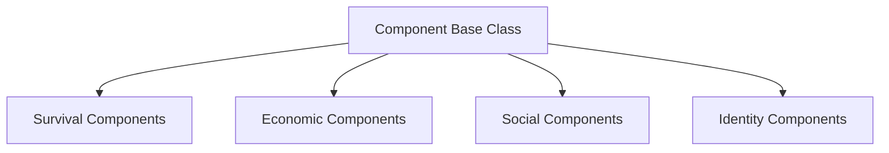
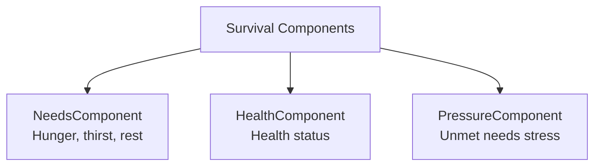
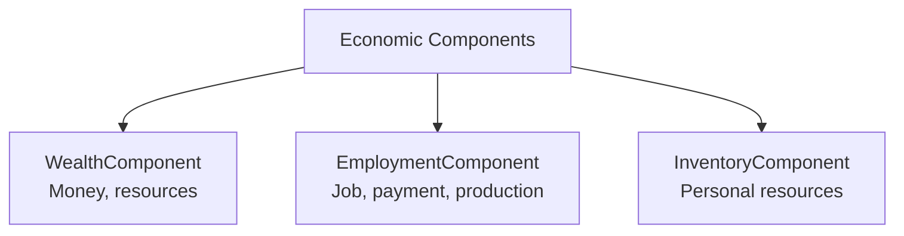
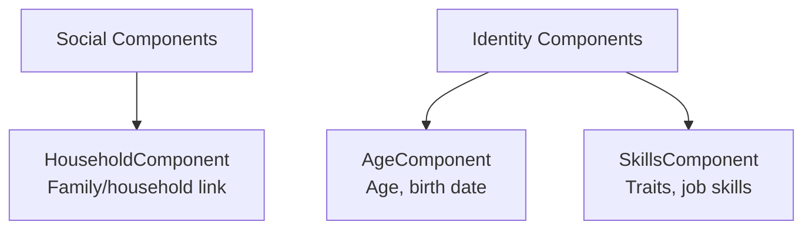
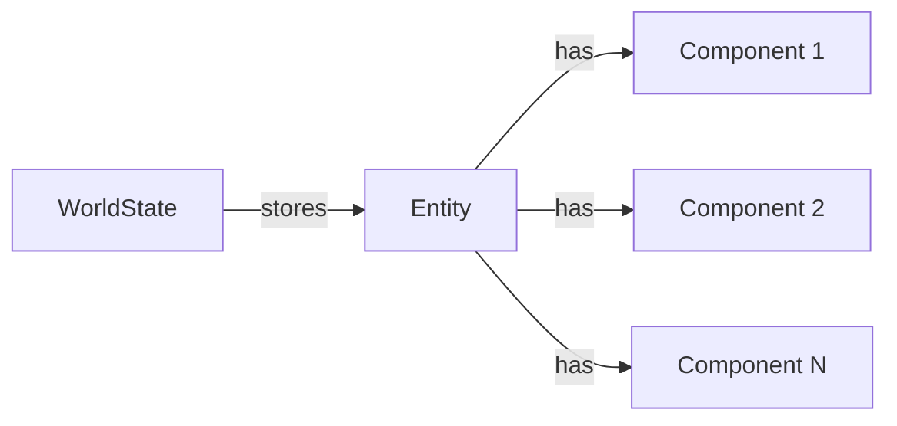
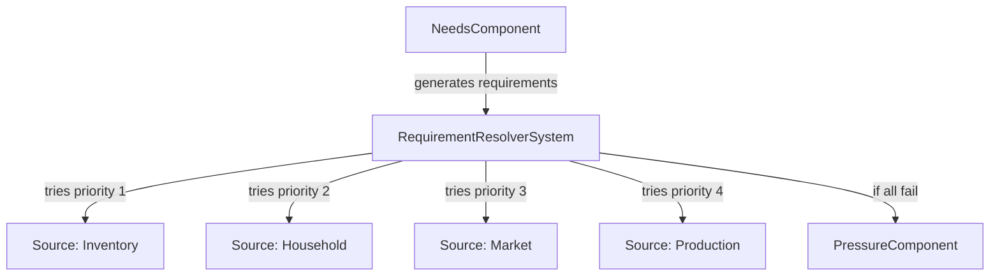
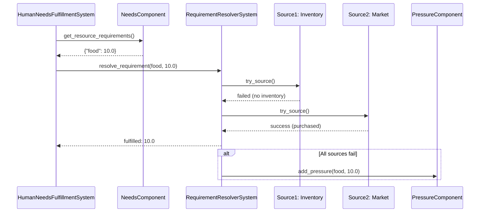

# Architecture

## Design Principles

- **Deterministic and replayable**: Same seed produces same results
- **Modular and extensible**: Systems don't depend on each other
- **Data-driven**: All behavior driven by configuration
- **System contract**: Every system follows the same interface
- **Hot-addable**: New systems can be added without engine changes

## Core Components

### Time System

- 1 tick = 1 hour
- Proper calendar handling (month lengths, leap years)
- Tracks absolute datetime, ticks elapsed, RNG seed

### World State

Contains:
- Current simulation datetime
- Total ticks elapsed
- RNG seed and state
- Config snapshot
- Registered systems
- Global resources
- Active modifiers
- Entities (with components)

## Entity Component System (ECS)

Lunaris Civitas uses a lightweight Entity Component System architecture for managing entities and their behaviors.

### ECS Component Hierarchy

All components inherit from the base `Component` class. Components are organized by purpose:

**Component Base Class:**

**Survival Components:**

**Economic Components:**

**Social & Identity Components:**

**Component Descriptions:**

**Survival Components:**

- **NeedsComponent**: Tracks hunger, thirst, and rest levels (0.0 = satisfied, 1.0 = critical)
- **HealthComponent**: Tracks health status (0.0 = dead, 1.0 = perfect health)
- **PressureComponent**: Accumulates stress from unmet resource requirements

**Economic Components:**

- **WealthComponent**: Stores resources owned (money, crypto, or any resource type)
- **EmploymentComponent**: Tracks job assignment, payment, and production capabilities
- **InventoryComponent**: Personal resource storage for immediate use

**Social Components:**

- **HouseholdComponent**: Links entity to a household for shared resources

**Identity Components:**

- **AgeComponent**: Tracks age, birth date, and lifespan
- **SkillsComponent**: Core traits (charisma, intelligence, strength, creativity, work_ethic) and job-specific skills

### Entity-Component Relationship

### Requirement Resolution Architecture

Entities have needs that create resource requirements. These requirements can be fulfilled through multiple sources, each with different conditions and requirements:

### System Interaction Flow

**Note:** This diagram shows the flow for fulfilling entity needs. `HumanNeedsFulfillmentSystem` queries entities with `NeedsComponent`, gets resource requirements, and calls `RequirementResolverSystem` to fulfill them through configured sources (inventory, household, market, production).

### System Contract

All systems implement:

- `system_id`: Unique identifier
- `init(world_state, config)`: Initialization
- `on_tick(world_state, current_datetime)`: Tick processing
- `shutdown(world_state)`: Optional cleanup

### Modifiers

Pure data structures for buffs/debuffs/events:

- Target systems or resources (via `target_type` and `target_id`)
- Support two effect types:
  - **Percentage effects**: Multiplier-based (e.g., increase/decrease by 30%)
  - **Direct effects**: Absolute value adjustments (e.g., add/subtract 500 units)
- Effect direction: `increase` or `decrease`
- Support automatic repeat mechanics with configurable probability and frequency
- Stacking: Multiple modifiers affecting the same target are applied sequentially
- When modifiers expire and repeat, new records are created immediately for seamless continuation

## System Interaction

Systems **never** call each other directly. All interaction happens through the world state:
- Systems read/write resources
- Systems query active modifiers
- Systems add/remove modifiers
- Systems never depend on other systems

## Further Reading

For detailed information about execution flows, call chains, and interface patterns, see:
- **[Core Execution Flows](../Development/CORE_FLOWS.md)** - Complete documentation of simulation loop, system patterns, and call chains
