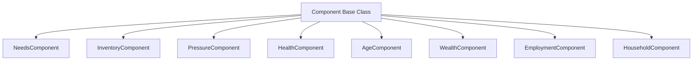
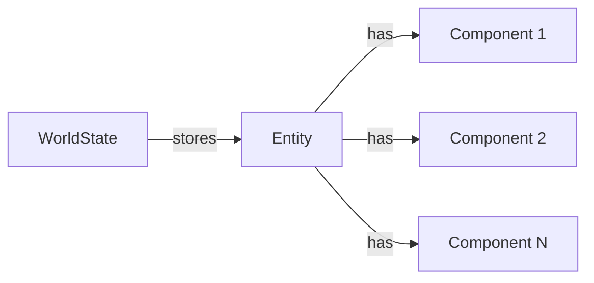
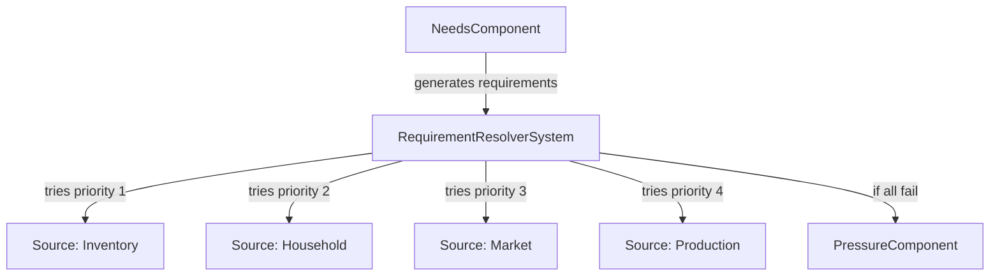
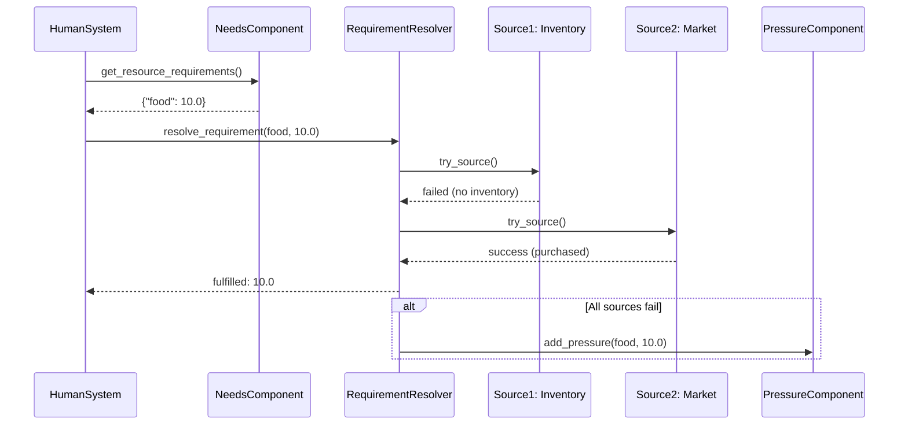

# Architecture

## Design Principles

- **Deterministic and replayable**: Same seed produces same results
- **Modular and extensible**: Systems don't depend on each other
- **Data-driven**: All behavior driven by configuration
- **System contract**: Every system follows the same interface
- **Hot-addable**: New systems can be added without engine changes

## Core Components

### Time System

- 1 tick = 1 hour
- Proper calendar handling (month lengths, leap years)
- Tracks absolute datetime, ticks elapsed, RNG seed

### World State

Contains:
- Current simulation datetime
- Total ticks elapsed
- RNG seed and state
- Config snapshot
- Registered systems
- Global resources
- Active modifiers
- Entities (with components)

## Entity Component System (ECS)

Lunaris Civitas uses a lightweight Entity Component System architecture for managing entities and their behaviors.

### ECS Component Hierarchy

### Entity-Component Relationship

### Requirement Resolution Architecture

Entities have needs that create resource requirements. These requirements can be fulfilled through multiple sources, each with different conditions and requirements:

### System Interaction Flow

### System Contract

All systems implement:
- `system_id`: Unique identifier
- `init(world_state, config)`: Initialization
- `on_tick(world_state, current_datetime)`: Tick processing
- `shutdown(world_state)`: Optional cleanup

### Modifiers

Pure data structures for buffs/debuffs/events:
- Target systems, resources, or categories
- Apply multipliers and additive adjustments
- Stacking rules: multiplicative first, then additive

## System Interaction

Systems **never** call each other directly. All interaction happens through the world state:
- Systems read/write resources
- Systems query active modifiers
- Systems add/remove modifiers
- Systems never depend on other systems

## Further Reading

For detailed information about execution flows, call chains, and interface patterns, see:
- **[Core Execution Flows](../Development/CORE_FLOWS.md)** - Complete documentation of simulation loop, system patterns, and call chains
