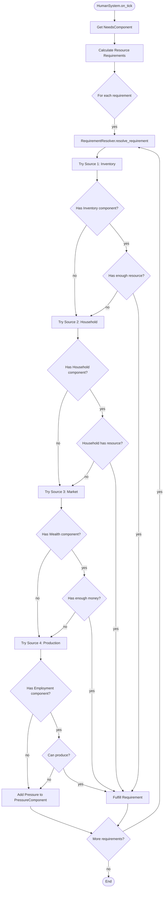
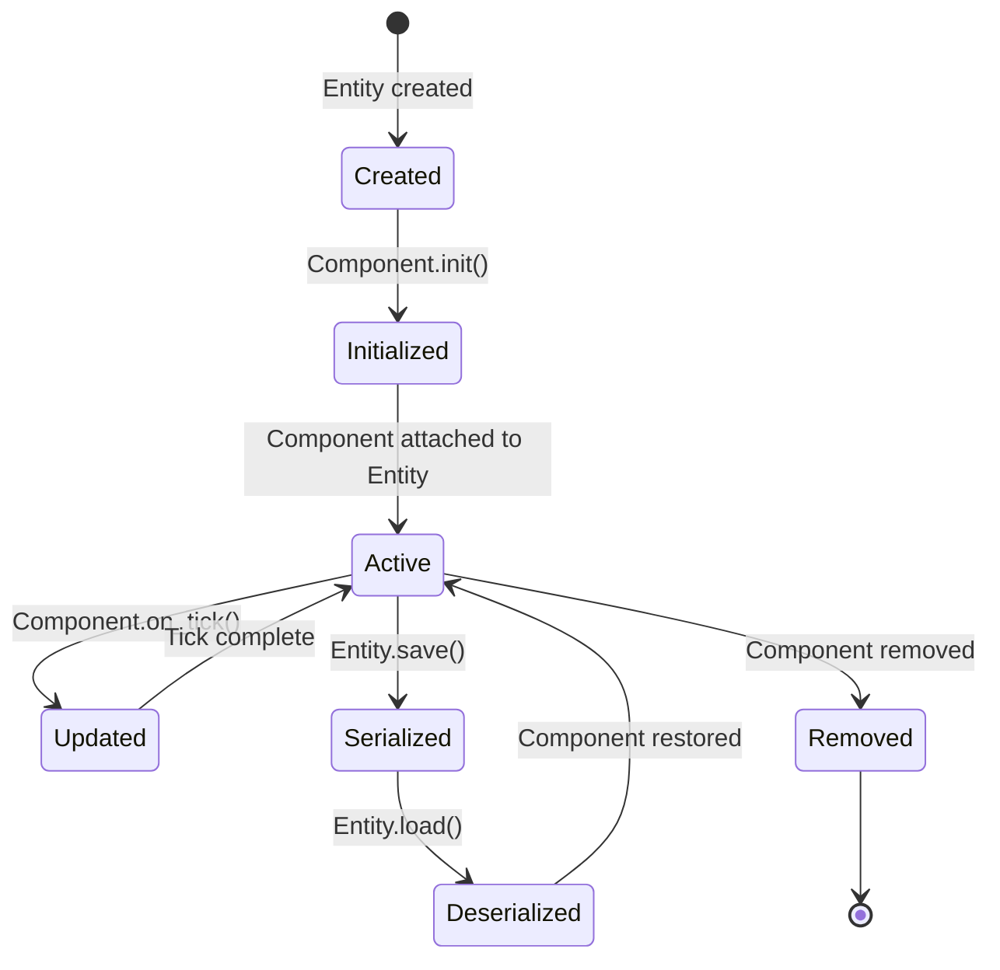
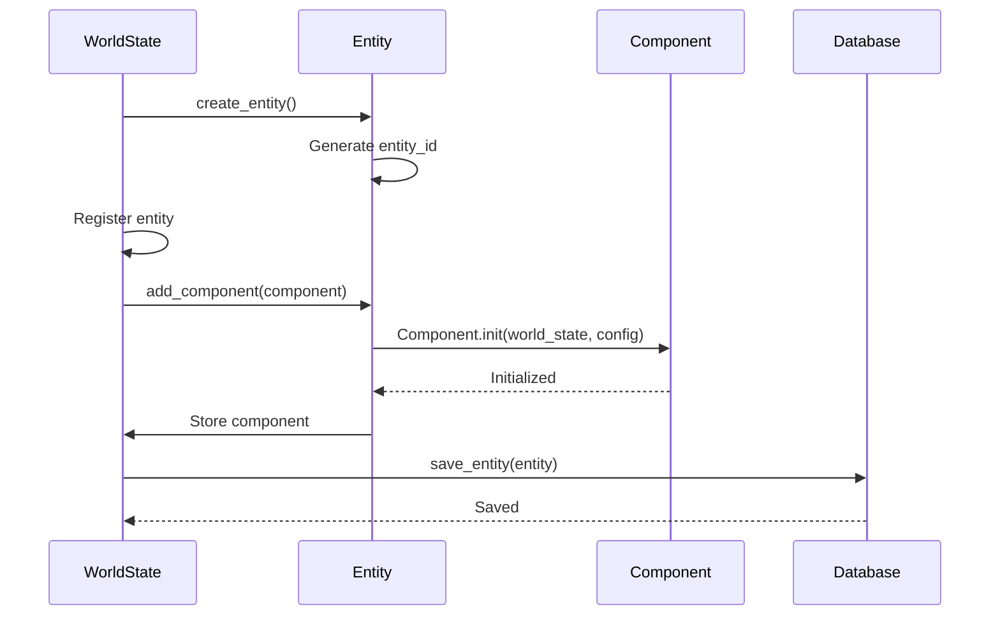
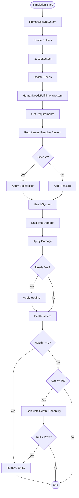
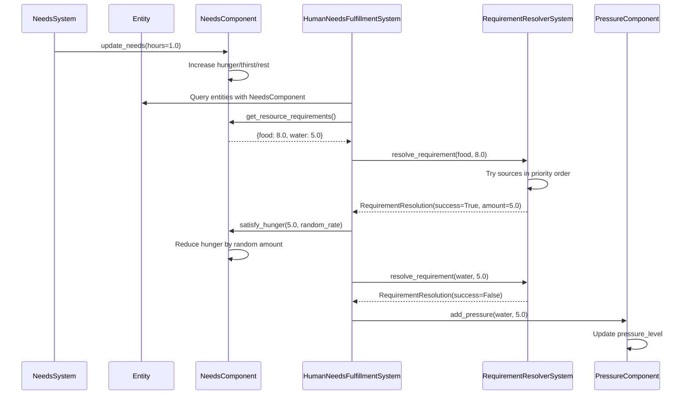
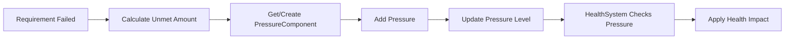

# Core Execution Flows

This document describes the key execution flows, call chains, and interface patterns in Lunaris Civitas. It's essential reading for understanding how the simulation engine works and how to extend it.

## Table of Contents

1. [Entry Point Flow](#entry-point-flow)
2. [Simulation Loop](#simulation-loop)
3. [System Interface Pattern](#system-interface-pattern)
4. [Model/Composable Patterns](#modelcomposable-patterns)
5. [Call Chains](#call-chains)

---

## Entry Point Flow

The simulation starts from the CLI entry point and flows through initialization to the main loop.

### Flow: `__main__.py` → `Simulation.run()`

```
1. src/__main__.py::main()
   ├─ Parse CLI arguments (--config, --resume, --max-ticks, etc.)
   ├─ Setup logging
   ├─ Create Simulation instance
   │  └─ Simulation.__init__(config_path, db_path, resume)
   │     ├─ Initialize world_state = None
   │     ├─ Initialize systems_registry = {}
   │     └─ Initialize logging/config tracking
   │
   ├─ Register systems
   │  ├─ sim.register_system(ResourceProductionSystem())
   │  ├─ sim.register_system(ResourceConsumptionSystem())
   │  └─ sim.register_system(ResourceReplenishmentSystem())
   │     └─ Each system stored in systems_registry dict
   │
   └─ sim.run(max_ticks)
      └─ [See Simulation Loop section below]
```

### Key Functions

**`src/__main__.py::main()`**
- Entry point for CLI execution
- Parses arguments, sets up logging
- Creates Simulation instance
- Registers all systems
- Calls `sim.run()`

**`Simulation.__init__()`**
- Initializes simulation state
- Sets up database path
- Prepares logging configuration
- Does NOT initialize world state yet (lazy initialization)

**`Simulation.register_system()`**
- Adds system to `systems_registry` dict
- Validates unique `system_id`
- Systems are NOT initialized yet

---

## Simulation Loop

The core simulation loop runs continuously, advancing time and calling systems each tick.

### Flow: `Simulation.run()` → Tick Processing

```
Simulation.run(max_ticks)
│
├─ [INITIALIZATION PHASE]
│  ├─ If resume:
│  │  └─ _resume_simulation()
│  │     ├─ Database.load_world_state()
│  │     ├─ Restore WorldState from database
│  │     ├─ Re-initialize systems with config
│  │     └─ Restore logging config
│  │
│  └─ Else (new simulation):
│     └─ _initialize_new_simulation(config)
│        ├─ Load config via load_config(config_path)
│        ├─ Parse simulation config (start_datetime, rng_seed)
│        ├─ Create SimulationTime instance
│        ├─ Create WorldState instance
│        ├─ Initialize resources from config
│        │  └─ For each resource in config:
│        │     ├─ Create Resource instance
│        │     └─ world_state.add_resource(resource)
│        │
│        ├─ Register and initialize systems
│        │  └─ For each system in config:
│        │     ├─ Get system from systems_registry
│        │     ├─ world_state.register_system(system)
│        │     └─ system.init(world_state, system_config)
│        │
│        └─ Log initial world state
│
├─ [MAIN LOOP]
│  └─ while True:
│     │
│     ├─ [TICK START]
│     │  ├─ Advance time
│     │  │  └─ current_datetime = world_state.simulation_time.advance_tick()
│     │  │     └─ Increments ticks_elapsed, updates current_datetime
│     │  │
│     │  ├─ Check modifier repeats
│     │  │  └─ _check_modifier_repeats(current_datetime)
│     │  │     ├─ Find expired modifiers with repeat_probability > 0
│     │  │     ├─ Check if should_check_repeat() for each
│     │  │     ├─ Roll probability die
│     │  │     └─ If repeat triggered: _create_modifier_repeat()
│     │  │
│     │  ├─ Cleanup expired modifiers
│     │  │  └─ world_state.cleanup_expired_modifiers()
│     │  │     └─ Deactivate expired modifiers (don't delete - may repeat)
│     │  │
│     │  ├─ Call all systems
│     │  │  └─ For each system in world_state.get_all_systems():
│     │  │     └─ system.on_tick(world_state, current_datetime)
│     │  │        └─ [System-specific processing - see System Interface section]
│     │  │
│     │  ├─ Periodic save (every 24 ticks = 1 day)
│     │  │  └─ if tick_count % 24 == 0:
│     │  │     └─ save()
│     │  │        └─ Database.save_world_state(world_state)
│     │  │
│     │  └─ Configurable logging
│     │     └─ _check_and_log(current_datetime)
│     │        ├─ Check if should log based on frequency/rate
│     │        └─ If yes: _log_world_state()
│     │
│     └─ [TICK END]
│        └─ Increment tick_count
│
└─ [SHUTDOWN]
   ├─ On KeyboardInterrupt or max_ticks reached
   ├─ Final save
   └─ shutdown()
      └─ Call system.shutdown() for each system
```

### Key Functions in Simulation Loop

**`Simulation.run(max_ticks)`**
- Main entry point for simulation execution
- Handles initialization (new or resume)
- Runs main loop until interrupted or max_ticks reached
- Manages periodic saves and logging

**`Simulation._initialize_new_simulation(config)`**
- Creates new WorldState from configuration
- Initializes all resources
- Registers and initializes all systems
- Sets up logging configuration

**`Simulation._resume_simulation()`**
- Loads WorldState from database
- Re-initializes systems with their config
- Restores logging configuration

**`Simulation._check_modifier_repeats(current_datetime)`**
- Checks expired modifiers for repeat probability
- Rolls probability die if repeat check is due
- Creates new modifier entry if repeat triggered

**`WorldState.cleanup_expired_modifiers()`**
- Deactivates expired modifiers (sets `_is_active_flag = False`)
- Does NOT delete modifiers (needed for repeat checking)

**`Simulation.save()`**
- Saves current WorldState to database
- Called periodically (every 24 ticks) and on shutdown

---

## System Interface Pattern

All systems extend the `System` abstract base class, which defines the contract.

### Base Interface: `System` (ABC)

```python
# src/core/system.py

class System(ABC):
    @property
    @abstractmethod
    def system_id(self) -> str:
        """Unique identifier for this system."""
        pass
    
    @abstractmethod
    def init(self, world_state: Any, config: Dict[str, Any]) -> None:
        """Initialize system with configuration."""
        pass
    
    @abstractmethod
    def on_tick(self, world_state: Any, current_datetime: datetime) -> None:
        """Process a simulation tick."""
        pass
    
    def shutdown(self, world_state: Any) -> None:
        """Optional cleanup on shutdown."""
        pass
```

### Extension Pattern: Concrete Systems

All systems follow this pattern:

```python
# Example: src/systems/resource/production.py

class ResourceProductionSystem(System):
    @property
    def system_id(self) -> str:
        return "ResourceProductionSystem"
    
    def __init__(self):
        """Initialize system-specific state."""
        self.production_rates: Dict[str, float] = {}
        self.production_frequencies: Dict[str, str] = {}
    
    def init(self, world_state: Any, config: Dict[str, Any]) -> None:
        """Called once during simulation initialization."""
        # Parse config
        # Store configuration in instance variables
        # Validate settings
        pass
    
    def on_tick(self, world_state: Any, current_datetime: datetime) -> None:
        """Called every tick (hourly)."""
        # System decides internally when to act:
        # - Check datetime for hourly/daily/weekly/monthly/yearly boundaries
        # - Query world_state for resources/modifiers
        # - Modify resources through world_state
        # - Never call other systems directly
        pass
    
    def shutdown(self, world_state: Any) -> None:
        """Optional cleanup."""
        pass
```

### System Call Chain Example: ResourceProductionSystem

```
Simulation.run() main loop
│
└─ system.on_tick(world_state, current_datetime)
   │
   └─ ResourceProductionSystem.on_tick()
      │
      ├─ For each resource in production_rates:
      │  │
      │  ├─ resource = world_state.get_resource(resource_id)
      │  │  └─ Returns Resource instance or None
      │  │
      │  ├─ Check if should produce based on frequency
      │  │  └─ _should_produce(frequency, current_datetime)
      │  │     └─ Checks datetime boundaries (hour/day/week/month/year)
      │  │
      │  ├─ Calculate production rate with modifiers
      │  │  └─ _calculate_production_rate(world_state, resource_id, base_rate)
      │  │     ├─ Get modifiers for resource
      │  │     │  └─ world_state.get_modifiers_for_resource(resource_id)
      │  │     │     └─ Returns List[Modifier] (active modifiers only)
      │  │     │
      │  │     ├─ Apply each modifier sequentially
      │  │     │  └─ For each modifier:
      │  │     │     └─ rate = modifier.calculate_effect(rate)
      │  │     │        └─ Modifier.calculate_effect()
      │  │     │           └─ apply_effect(base_value, effect_type, effect_value, direction)
      │  │     │              └─ Applies percentage or direct effect
      │  │     │
      │  │     └─ Return modified rate
      │  │
      │  └─ Add production to resource
      │     └─ resource.add(production_rate)
      │        └─ Resource.add()
      │           ├─ Check capacity limits
      │           ├─ Update _current_amount
      │           └─ _update_status()
      │              └─ calculate_resource_status(amount, max_capacity)
      │                 └─ Returns StatusLevel enum
```

### System Interaction Rules

1. **Systems NEVER call other systems directly**
   - No `world_state.get_system("OtherSystem").do_something()`
   - All interaction through WorldState

2. **Systems query WorldState for data**
   - `world_state.get_resource(resource_id)`
   - `world_state.get_modifiers_for_resource(resource_id)`
   - `world_state.get_active_modifiers()`

3. **Systems modify WorldState**
   - `resource.add(amount)` / `resource.consume(amount)`
   - `world_state.add_modifier(modifier)`

4. **Systems decide internally when to act**
   - Check `current_datetime` for boundaries
   - Act hourly, daily, weekly, monthly, or yearly as needed

---

## Model/Composable Patterns

Models (Resource, Modifier) follow a consistent pattern for serialization, validation, and behavior.

### Resource Model Pattern

```python
# src/models/resource.py

class Resource:
    """Represents a global resource in the simulation."""
    
    def __init__(self, resource_id, name, initial_amount, ...):
        """Initialize with validation."""
        # Validate inputs
        # Set instance variables
        # Calculate initial status
    
    # Properties
    @property
    def current_amount(self) -> float:
        """Read-only access to current amount."""
        return self._current_amount
    
    @property
    def status(self) -> StatusLevel:
        """Get current status level."""
        return StatusLevel.from_label(self.status_id)
    
    # Behavior methods
    def add(self, amount: float) -> float:
        """Add amount, respecting capacity limits."""
        # Validate
        # Apply capacity limits
        # Update internal state
        # Update status
        # Return actual amount added
    
    def consume(self, amount: float) -> float:
        """Consume amount, respecting current amount."""
        # Validate
        # Consume up to available
        # Update internal state
        # Update status
        # Return actual amount consumed
    
    # Serialization
    def to_dict(self) -> dict:
        """Serialize to dictionary."""
        return {
            'id': self.id,
            'current_amount': self._current_amount,
            # ... all fields
        }
    
    @classmethod
    def from_dict(cls, data: dict) -> 'Resource':
        """Deserialize from dictionary."""
        return cls(
            resource_id=data['id'],
            initial_amount=data['current_amount'],
            # ... restore all fields
        )
```

### Modifier Model Pattern

```python
# src/models/modifier.py

class Modifier:
    """Represents a modifier (buff/debuff/event)."""
    
    def __init__(self, modifier_name, resource_id, start_year, end_year, ...):
        """Initialize with validation."""
        # Validate required fields
        # Convert string enums to enum objects
        # Set instance variables
    
    # Status checks
    def is_active(self, current_datetime: Optional[datetime] = None) -> bool:
        """Check if modifier is currently active."""
        # Check _is_active_flag
        # Check datetime boundaries
    
    def has_expired(self, current_datetime: datetime) -> bool:
        """Check if modifier has expired."""
        # Compare current_year to end_year
    
    def should_check_repeat(self, current_datetime: datetime) -> bool:
        """Check if we should check for repeat at this datetime."""
        # Check datetime boundaries based on repeat_frequency
    
    # Behavior
    def calculate_effect(self, base_value: float) -> float:
        """Calculate effect on a base value."""
        # Apply effect_type (percentage/direct)
        # Apply effect_direction (increase/decrease)
        # Return modified value
    
    # Serialization (same pattern as Resource)
    def to_dict(self) -> dict:
        """Serialize to dictionary."""
        pass
    
    @classmethod
    def from_dict(cls, data: dict) -> 'Modifier':
        """Deserialize from dictionary."""
        pass
```

### Composable Pattern: Enums and Utilities

The codebase uses composable enums and utility functions:

```python
# src/systems/generics/effect_type.py

class EffectType(Enum):
    PERCENTAGE = "percentage"
    DIRECT = "direct"

def apply_effect(base_value, effect_type, effect_value, direction) -> float:
    """Apply effect to base value."""
    # Composable function used by Modifier.calculate_effect()
    pass

# src/systems/generics/status.py

class StatusLevel(Enum):
    DEPLETED = ("depleted", ...)
    AT_RISK = ("at_risk", ...)
    # ...

def calculate_resource_status(amount, max_capacity) -> StatusLevel:
    """Calculate status based on amount and capacity."""
    # Composable function used by Resource._update_status()
    pass
```

### Model Extension Pattern

When creating new models:

1. **Define class with `__init__`**
   - Validate inputs
   - Set instance variables
   - Initialize computed properties

2. **Add behavior methods**
   - Methods that modify internal state
   - Methods that query state
   - Methods that interact with WorldState

3. **Implement serialization**
   - `to_dict()` - serialize to dictionary
   - `from_dict()` - classmethod to deserialize
   - Used by persistence layer

4. **Use composable utilities**
   - Import enum types from `src/systems/generics/`
   - Use utility functions for calculations
   - Keep models focused on data and simple behavior

---

## Call Chains

Detailed call chains for common operations.

### Call Chain: Resource Production with Modifiers

```
Simulation.run() main loop
│
├─ system.on_tick(world_state, current_datetime)
│  └─ ResourceProductionSystem.on_tick()
│     │
│     ├─ world_state.get_resource(resource_id)
│     │  └─ WorldState.get_resource()
│     │     └─ Returns self._resources.get(resource_id)
│     │
│     ├─ _should_produce(frequency, current_datetime)
│     │  └─ Checks datetime boundaries
│     │
│     └─ _calculate_production_rate(world_state, resource_id, base_rate)
│        │
│        ├─ world_state.get_modifiers_for_resource(resource_id)
│        │  └─ WorldState.get_modifiers_for_resource()
│        │     ├─ Iterate self._modifiers.values()
│        │     ├─ Check mod.resource_id == resource_id
│        │     └─ Check mod.is_active(current_datetime)
│        │        └─ Modifier.is_active()
│        │           ├─ Check _is_active_flag
│        │           └─ Check start_year <= current_year < end_year
│        │
│        └─ For each modifier:
│           └─ rate = modifier.calculate_effect(rate)
│              └─ Modifier.calculate_effect()
│                 └─ apply_effect(base_value, effect_type, effect_value, direction)
│                    └─ EffectType.apply_effect()
│                       ├─ If PERCENTAGE: base * (1 ± value)
│                       └─ If DIRECT: base ± value
│
└─ resource.add(production_rate)
   └─ Resource.add()
      ├─ Check capacity limits
      ├─ self._current_amount += amount_to_add
      └─ self._update_status()
         └─ calculate_resource_status(self._current_amount, self.max_capacity)
            └─ StatusLevel.calculate_resource_status()
               ├─ Calculate utilization percentage
               └─ Return appropriate StatusLevel enum
```

### Call Chain: Modifier Repeat Checking

```
Simulation.run() main loop
│
├─ _check_modifier_repeats(current_datetime)
│  │
│  ├─ Iterate world_state._modifiers.values()
│  │  └─ For each modifier:
│  │     ├─ modifier.has_expired(current_datetime)
│  │     │  └─ Modifier.has_expired()
│  │     │     └─ Check current_year >= end_year
│  │     │
│  │     ├─ modifier.repeat_probability > 0.0
│  │     │
│  │     └─ modifier.should_check_repeat(current_datetime)
│  │        └─ Modifier.should_check_repeat()
│  │           └─ Check datetime boundaries based on repeat_frequency
│  │
│  ├─ Roll probability die
│  │  └─ world_state.rng.random()
│  │     └─ Random.random() (seeded RNG)
│  │
│  └─ If repeat triggered:
│     └─ _create_modifier_repeat(parent_modifier, current_datetime)
│        │
│        ├─ Calculate new duration
│        ├─ Calculate new start_year/end_year
│        │
│        ├─ Create new Modifier instance
│        │  └─ Modifier.__init__(...)
│        │     ├─ Validate inputs
│        │     ├─ Convert string enums to enum objects
│        │     └─ Set instance variables
│        │
│        ├─ world_state.add_modifier(new_modifier)
│        │  └─ WorldState.add_modifier()
│        │     └─ self._modifiers[modifier.id] = modifier
│        │
│        └─ Save to database
│           └─ Database.insert_modifier()
│              └─ SQL INSERT INTO modifiers ...
```

### Call Chain: World State Persistence

```
Simulation.save()
│
└─ Database.save_world_state(world_state)
   │
   ├─ world_state.to_dict()
   │  └─ WorldState.to_dict()
   │     ├─ simulation_time.to_dict()
   │     │  └─ SimulationTime.to_dict()
   │     │     └─ Returns dict with datetime, ticks_elapsed, rng_state
   │     │
   │     ├─ For each resource:
   │     │  └─ resource.to_dict()
   │     │     └─ Resource.to_dict()
   │     │        └─ Returns dict with all resource fields
   │     │
   │     ├─ For each modifier:
   │     │  └─ modifier.to_dict()
   │     │     └─ Modifier.to_dict()
   │     │        └─ Returns dict with all modifier fields
   │     │
   │     └─ Return complete dict
   │
   └─ Database._save_to_db(data)
      ├─ Serialize to JSON
      └─ SQL INSERT/UPDATE INTO world_state ...
```

### Call Chain: Resuming Simulation

```
Simulation.run() with resume=True
│
└─ _resume_simulation()
   │
   ├─ Database.load_world_state(systems_registry)
   │  │
   │  ├─ Load JSON from database
   │  │
   │  └─ WorldState.from_dict(data, systems_registry)
   │     └─ WorldState.from_dict()
   │        ├─ SimulationTime.from_dict(data['simulation_time'])
   │        │  └─ Restore SimulationTime instance
   │        │
   │        ├─ Create WorldState instance
   │        │
   │        ├─ For each resource in data['resources']:
   │        │  └─ Resource.from_dict(res_data)
   │        │     └─ Resource.from_dict()
   │        │        └─ Create Resource instance from dict
   │        │
   │        ├─ For each modifier in data['modifiers']:
   │        │  └─ Modifier.from_dict(mod_data)
   │        │     └─ Modifier.from_dict()
   │        │        └─ Create Modifier instance from dict
   │        │
   │        └─ Restore systems from registry
   │           └─ For each system_id in data['systems']:
   │              └─ world_state._systems[system_id] = systems_registry[system_id]
   │
   └─ Re-initialize systems
      └─ For each system:
         └─ system.init(world_state, system_config)
            └─ System-specific initialization
```

---

## Entity Component System Flows

### Requirement Resolution Flow

The requirement resolution system allows entities to fulfill needs through multiple sources:



### Component Lifecycle

Components go through a lifecycle from creation to removal:



### Entity Creation and Component Attachment



### Human Lifecycle Flow

The complete human lifecycle from spawn to death:



### Need Fulfillment Flow

Detailed flow of how needs are fulfilled:



### Pressure Accumulation Flow

When requirements cannot be fulfilled, pressure accumulates:



---

## Summary

### Key Takeaways

1. **Entry Point**: `__main__.py` → `Simulation.run()` → Main loop
2. **Simulation Loop**: Advance time → Check repeats → Cleanup → Call systems → Save/Log
3. **System Interface**: All systems extend `System` ABC with `system_id`, `init()`, `on_tick()`, `shutdown()`
4. **Model Pattern**: Models have `to_dict()`/`from_dict()` for serialization, validation in `__init__`, behavior methods
5. **No Direct Calls**: Systems never call other systems directly - all interaction through WorldState
6. **Composable Utilities**: Enums and utility functions in `src/systems/generics/` provide reusable behavior

### When Adding New Code

- **New System**: Extend `System`, implement required methods, register in `__main__.py`
- **New Model**: Follow Resource/Modifier pattern with `to_dict()`/`from_dict()`
- **New Utility**: Add to `src/systems/generics/` if reusable across systems
- **New Call Chain**: Document the flow from entry point through all function calls
