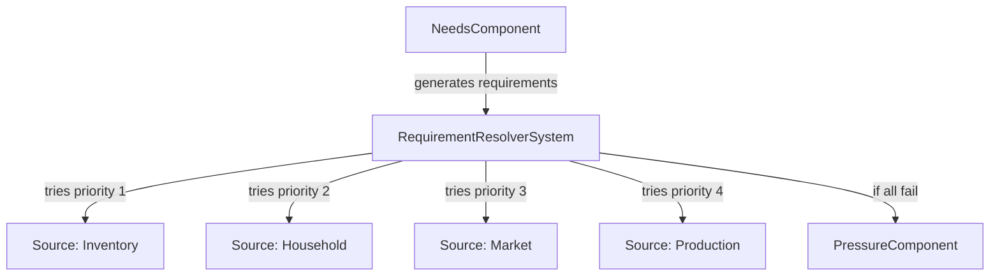
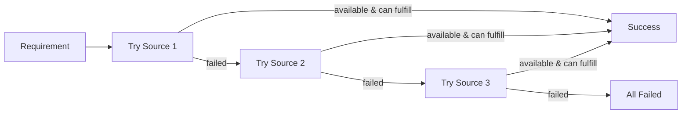
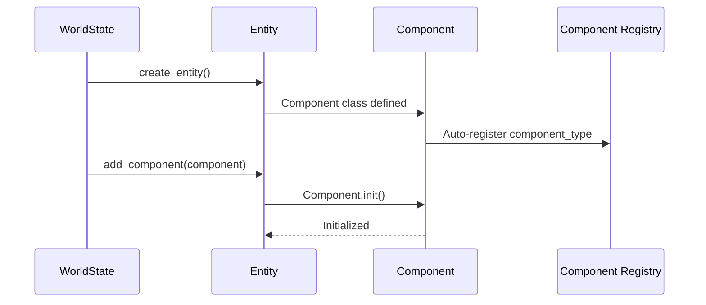
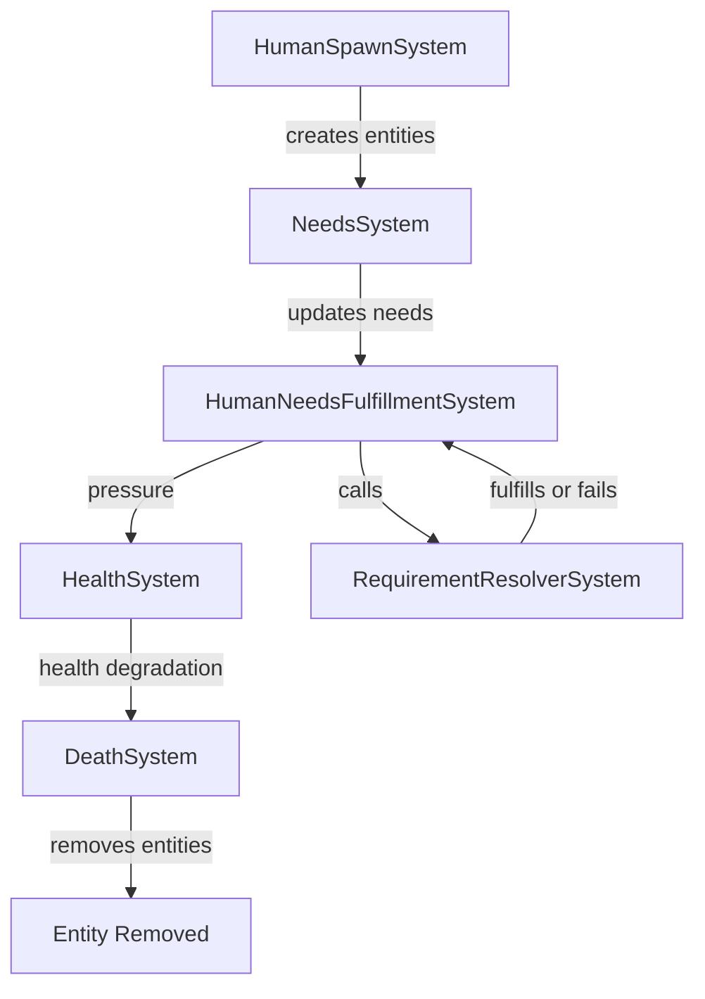
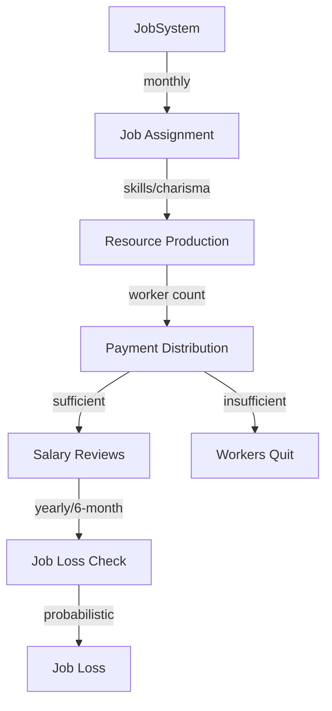

# Systems

## System Contract

All systems must implement the `System` base class:

```python
from src.core.system import System
from datetime import datetime

class MySystem(System):
    @property
    def system_id(self) -> str:
        return "MySystem"
    
    def init(self, world_state, config):
        # Initialize system
        pass
    
    def on_tick(self, world_state, current_datetime):
        # Process tick
        pass
    
    def shutdown(self, world_state):
        # Optional cleanup
        pass
```

## System Organization

Systems are organized by category in subfolders:
- `src/systems/resource/` - Resource management systems
- `src/systems/human/` - Human/entity-related systems
- Future: `src/systems/disease/`, etc.

## Entity Component System (ECS)

Lunaris Civitas uses a lightweight Entity Component System for managing entities and their behaviors. Entities are containers for components, and systems operate on components rather than entity types.

### Components

Components are data containers attached to entities. Available components include:

- **NeedsComponent**: Tracks hunger, thirst, and rest levels
- **InventoryComponent**: Stores personal resources
- **PressureComponent**: Tracks unmet resource requirements
- **HealthComponent**: Tracks health status
- **AgeComponent**: Tracks age and birth date
- **WealthComponent**: Stores resources (money, crypto, bananas, etc.) - supports multiple resource types
- **EmploymentComponent**: Stores job information, payment resources, and salary caps
- **SkillsComponent**: Core traits (charisma, intelligence, strength, creativity, work_ethic) and job-specific skills
- **HouseholdComponent**: Links entity to household

### Requirement Resolution

The requirement resolution system allows entities to fulfill needs through multiple sources, each with different conditions and requirements:



### Source Priority Resolution



## Phase 1 Systems

### ResourceProductionSystem

Produces resources based on configuration. Respects modifiers affecting production.

### ResourceConsumptionSystem

Consumes resources based on configuration. Respects modifiers affecting consumption.

### ResourceReplenishmentSystem

Replenishes resources based on their `replenishment_rate` property. Only replenishes non-finite resources.

### ResourceHistorySystem

Tracks resource values over time for analytics and trend analysis. Saves resource history to the database at configurable intervals (hourly, daily, weekly, monthly, or yearly).

**Configuration:**
- `enabled`: Enable/disable history tracking (default: `true`)
- `frequency`: Save frequency - `'hourly'`, `'daily'`, `'weekly'`, `'monthly'`, or `'yearly'` (default: `'daily'`)
- `rate`: Save every N periods (e.g., `rate: 2` means every 2 days if frequency is daily) (default: `1`)
- `resources`: List of resource IDs to track (empty list = track all resources) (default: `[]`)

**Example:**
```yaml
systems_config:
  ResourceHistorySystem:
    enabled: true
    frequency: daily  # Save history daily at midnight
    rate: 1  # Every 1 day
    resources: []  # Track all resources
```

History data can be exported to CSV using the `make export-resources` command or `python -m src.cli.export_resources`.

### EntityHistorySystem

Tracks entity and component metrics over time for analytics and trend analysis. Saves aggregated entity history to the database at configurable intervals (hourly, daily, weekly, monthly, or yearly).

**Configuration:**
- `enabled`: Enable/disable history tracking (default: `true`)
- `frequency`: Save frequency - `'hourly'`, `'daily'`, `'weekly'`, `'monthly'`, or `'yearly'` (default: `'daily'`)
- `rate`: Save every N periods (e.g., `rate: 2` means every 2 days if frequency is daily) (default: `1`)
- `component_types`: List of component types to track (empty list = track all components) (default: `[]`)

**Metrics Tracked:**
- Total entity count
- Component distribution (how many entities have each component type)
- Average needs levels (hunger, thirst, rest)
- Average pressure level and entities under pressure
- Average health and entities at risk
- Average age and wealth
- Employment count

**Example:**
```yaml
systems_config:
  EntityHistorySystem:
    enabled: true
    frequency: daily  # Save history daily at midnight
    rate: 1  # Every 1 day
    component_types: []  # Track all components
```

History data can be exported to CSV using the `make export-entities` command or `python -m src.cli.export_entities`.

## Phase 2 Systems

### HumanSpawnSystem

Creates initial population and supports runtime spawning (TEMPORARY PLACEHOLDER for Phase 4 reproduction system).

**NOTE**: Runtime spawning is a temporary placeholder. This system will be replaced by a proper reproduction system in Phase 4 that handles births based on fertility, relationships, and other factors.

**Features:**
- Creates initial "seed crew" with randomized ages
- Supports ongoing spawning during simulation (with clear documentation this is temporary)
- Runtime births always use current simulation date as birth_date (age = 0)
- Configurable population size and component distributions

**Configuration:**
```yaml
systems_config:
  HumanSpawnSystem:
    enabled: true
    initial_population: 100
    spawn_frequency: daily  # hourly, daily, weekly, monthly, yearly
    spawn_rate: 0  # 0 = disabled, N = spawn N entities per period
    seed_crew:
      age_range: [18, 65]  # Years for initial population
      components:
        Needs: 100  # Percentage (all get Needs)
        Health: 100
        Age: 100
        Pressure: 50  # 50% get Pressure
    runtime_spawn:
      components:
        Needs: 100
        Health: 100
        Age: 100  # Always age 0 (birth_date = current_date)
        Pressure: 0  # Newborns start without pressure
```

### NeedsSystem

Updates entity needs (hunger, thirst, rest) over time with randomized decay rates per entity (individual metabolism).

**Features:**
- Each entity has randomized decay rates (set on first tick, persistent)
- Configurable base rates with per-entity variation
- Runs hourly to update needs

**Configuration:**
```yaml
systems_config:
  NeedsSystem:
    enabled: true
    frequency: hourly  # Always hourly for needs decay
    base_hunger_rate: 0.01  # Per hour, base rate
    hunger_rate_variance: 0.005  # ±variance for randomization
    base_thirst_rate: 0.015
    thirst_rate_variance: 0.005
    base_rest_rate: 0.005
    rest_rate_variance: 0.002
```

### HumanNeedsFulfillmentSystem

Actively fulfills needs by calling RequirementResolverSystem with randomized satisfaction amounts.

**Features:**
- Queries entities with NeedsComponent
- Gets requirements via `get_resource_requirements()`
- Calls RequirementResolverSystem to fulfill
- Applies randomized satisfaction amounts (e.g., 5-10 units restore hunger)
- Adds pressure on failure

**Configuration:**
```yaml
systems_config:
  HumanNeedsFulfillmentSystem:
    enabled: true
    frequency: hourly
    satisfaction_ranges:
      food:
        hunger_restore_min: 0.05  # Per unit (randomized per call)
        hunger_restore_max: 0.15
      water:
        thirst_restore_min: 0.10
        thirst_restore_max: 0.30
      rest:
        rest_restore_min: 0.05  # Per hour
        rest_restore_max: 0.15
```

### HealthSystem

Converts pressure and unmet needs into health degradation with randomized damage amounts.

**Features:**
- Updates health based on pressure level and unmet needs
- Applies randomized damage per tick
- Health can recover slowly if needs are met
- Configurable damage/healing ranges

**Configuration:**
```yaml
systems_config:
  HealthSystem:
    enabled: true
    frequency: hourly
    pressure_damage:
      min_per_tick: 0.001  # At pressure_level = 1.0 (randomized)
      max_per_tick: 0.005
    unmet_needs_damage:
      hunger:
        min_per_tick: 0.0005  # At hunger = 1.0 (randomized)
        max_per_tick: 0.002
      thirst:
        min_per_tick: 0.001
        max_per_tick: 0.003
      rest:
        min_per_tick: 0.0002
        max_per_tick: 0.001
    healing_rate:
      min_per_tick: 0.0001  # When needs met (randomized)
      max_per_tick: 0.0005
```

### DeathSystem

Handles entity death from health degradation and age-based mortality.

**Features:**
- Checks health <= 0 for immediate death
- Age-based mortality with probability curve
- Most deaths occur between 73-100 (peak around 85)
- Exponential probability curve allows rare outliers past 100
- No guaranteed death - probability-based only

**Configuration:**
```yaml
systems_config:
  DeathSystem:
    enabled: true
    frequency: hourly
    age_mortality:
      old_age_start: 70  # Years - mortality starts increasing
      old_age_death_chance_min: 0.00001  # Per hour at old_age_start (randomized)
      old_age_death_chance_max: 0.0001
      peak_mortality_age: 85  # Age where most deaths occur
      chance_increase_per_year: 0.00001  # Base increase per year
      chance_multiplier_per_year: 1.1  # Exponential multiplier after peak
      # No max_age - outliers can survive past 100 (very rare)
```

### JobSystem

Manages job assignment, resource production, and payment distribution. Jobs can pay in any resource type (money, crypto, bananas, etc.), and payment can be multiple resource types simultaneously.

**Features:**
- Job assignment based on skills, charisma, age, and dynamic hiring chance
- Resource production based on job type and worker count
- Payment in any resource type (fully configurable)
- Salary increases (yearly and rare 6-month raises) up to max payment cap
- Job loss mechanism (firing, quitting, layoffs)
- Unpaid workers automatically quit (real-world consequence)
- Percentage-based job limits (e.g., max 10% of population can be farmers)
- Age requirements per job type

**Configuration:**
```yaml
systems_config:
  JobSystem:
    enabled: true
    assignment_frequency: monthly  # When to assign jobs
    production_frequency: monthly  # When production jobs produce
    min_work_age: 15  # Global minimum
    max_work_age: 70  # Global maximum
    base_hiring_chance: 0.3  # Base chance per month
    hiring_chance_multiplier: 0.5  # Multiplier for dynamic hiring
    yearly_raise_probability: 0.7  # Chance of yearly raise
    six_month_raise_probability: 0.05  # Rare 6-month raise
    raise_amount_range: [0.02, 0.05]  # 2-5% increase
    jobs:
      farmer:
        name: Farmer
        max_percentage: 10.0  # Max 10% of population
        payment:
          money: 100.0  # Can pay in multiple resources
          # crypto: 2.0  # Optional additional payment
        max_payment_cap:
          money: 130.0  # Max after raises
        min_payment:
          money: 50.0  # Minimum payment
        min_age: 16
        production:
          resource_id: food
          rate: 50.0  # Per worker per production period
          frequency: monthly
        required_skill: farming
        skill_weight: 0.7
        charisma_weight: 0.1
        job_type: production
```

**Payment Examples:**
- Single resource: `payment: {money: 100.0}`
- Multiple resources: `payment: {money: 80.0, crypto: 2.0}`
- Integer-based resources: `payment: {bananas: 10.0}`

### RequirementResolverSystem

Resolves resource requirements by trying multiple sources in priority order. Handles contextual requirements where the same need can be met through different paths (inventory, household, market, production).

**Multi-Resource Costs:**
Market sources can require multiple resource types for payment. For example, food might cost both money and crypto, or bananas and money.

**Configuration:**
```yaml
systems_config:
  RequirementResolver:
    requirement_sources:
      food:
        - source_id: inventory
          source_type: inventory
          priority: 1
          conditions:
            has_component: "Inventory"
          requirements: {}
          fulfillment_method: "consume_from_inventory"
        - source_id: household
          source_type: household
          priority: 2
          conditions:
            has_component: "Household"
          requirements: {}
          fulfillment_method: "consume_from_household"
        - source_id: market
          source_type: market
          priority: 3
          conditions:
            has_component: "Wealth"
          requirements:
            money: 5.0  # Per unit
            crypto: 1.0  # Can require multiple resources
          fulfillment_method: "purchase_from_market"
        - source_id: production_farmer
          source_type: production
          priority: 4
          conditions:
            has_component: "Employment"
            employment_type: "farmer"
          requirements:
            seeds: 0.1  # Per unit produced
          fulfillment_method: "produce_from_job"
```

**Source Types:**
- `inventory`: Personal inventory (no requirement, already owned)
- `household`: Shared household resources (no requirement, shared)
- `market`: Purchase from market (can require multiple resource types: money, crypto, bananas, etc.)
- `production`: Produce through job (requires inputs like seeds)

**Multi-Resource Cost Examples:**
- Single resource: `requirements: {money: 5.0}`
- Multiple resources: `requirements: {money: 5.0, crypto: 1.0}`
- Integer-based resources: `requirements: {bananas: 3.0}`

**Component Registration Flow:**



**Human Lifecycle Flow:**



**Job System Flow:**



History data can be exported to CSV using the `make export-resources` command or `python -m src.cli.export_resources`.

## Adding a New System

See [Adding Systems](ADDING_SYSTEMS.md) for detailed instructions.
