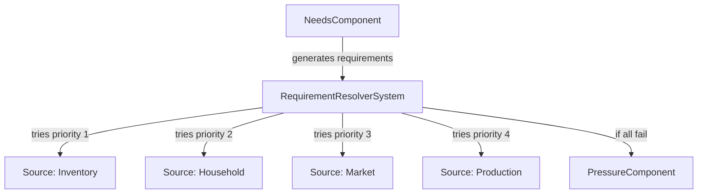
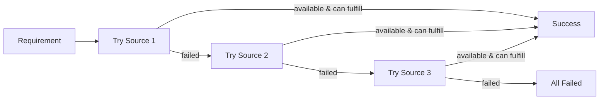
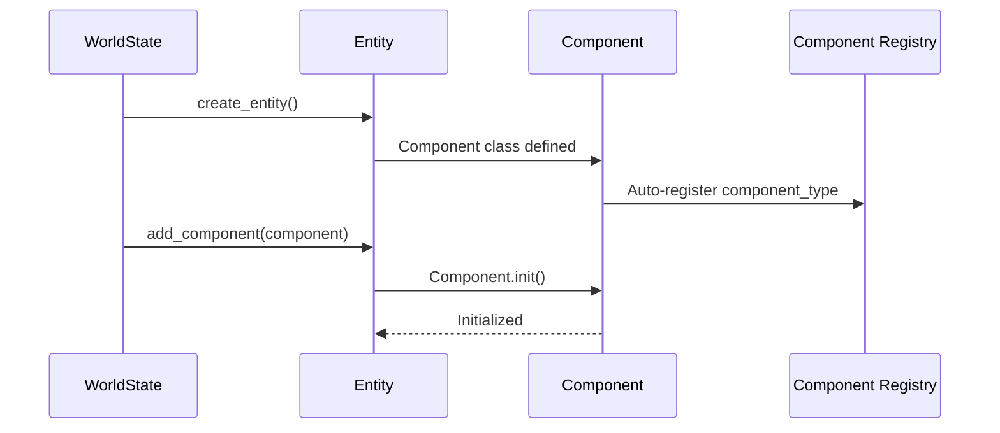

# Systems

## System Contract

All systems must implement the `System` base class:

```python
from src.core.system import System
from datetime import datetime

class MySystem(System):
    @property
    def system_id(self) -> str:
        return "MySystem"
    
    def init(self, world_state, config):
        # Initialize system
        pass
    
    def on_tick(self, world_state, current_datetime):
        # Process tick
        pass
    
    def shutdown(self, world_state):
        # Optional cleanup
        pass
```

## System Organization

Systems are organized by category in subfolders:
- `src/systems/resource/` - Resource management systems
- `src/systems/human/` - Human/entity-related systems
- Future: `src/systems/disease/`, etc.

## Entity Component System (ECS)

Lunaris Civitas uses a lightweight Entity Component System for managing entities and their behaviors. Entities are containers for components, and systems operate on components rather than entity types.

### Components

Components are data containers attached to entities. Available components include:

- **NeedsComponent**: Tracks hunger, thirst, and rest levels
- **InventoryComponent**: Stores personal resources
- **PressureComponent**: Tracks unmet resource requirements
- **HealthComponent**: Tracks health status
- **AgeComponent**: Tracks age and birth date
- **WealthComponent**: Stores money/resources
- **EmploymentComponent**: Stores job information
- **HouseholdComponent**: Links entity to household

### Requirement Resolution

The requirement resolution system allows entities to fulfill needs through multiple sources, each with different conditions and requirements:



### Source Priority Resolution



## Phase 1 Systems

### ResourceProductionSystem

Produces resources based on configuration. Respects modifiers affecting production.

### ResourceConsumptionSystem

Consumes resources based on configuration. Respects modifiers affecting consumption.

### ResourceReplenishmentSystem

Replenishes resources based on their `replenishment_rate` property. Only replenishes non-finite resources.

### ResourceHistorySystem

Tracks resource values over time for analytics and trend analysis. Saves resource history to the database at configurable intervals (hourly, daily, weekly, monthly, or yearly).

**Configuration:**
- `enabled`: Enable/disable history tracking (default: `true`)
- `frequency`: Save frequency - `'hourly'`, `'daily'`, `'weekly'`, `'monthly'`, or `'yearly'` (default: `'daily'`)
- `rate`: Save every N periods (e.g., `rate: 2` means every 2 days if frequency is daily) (default: `1`)
- `resources`: List of resource IDs to track (empty list = track all resources) (default: `[]`)

**Example:**
```yaml
systems_config:
  ResourceHistorySystem:
    enabled: true
    frequency: daily  # Save history daily at midnight
    rate: 1  # Every 1 day
    resources: []  # Track all resources
```

History data can be exported to CSV using the `make export-resources` command or `python -m src.cli.export_resources`.

### EntityHistorySystem

Tracks entity and component metrics over time for analytics and trend analysis. Saves aggregated entity history to the database at configurable intervals (hourly, daily, weekly, monthly, or yearly).

**Configuration:**
- `enabled`: Enable/disable history tracking (default: `true`)
- `frequency`: Save frequency - `'hourly'`, `'daily'`, `'weekly'`, `'monthly'`, or `'yearly'` (default: `'daily'`)
- `rate`: Save every N periods (e.g., `rate: 2` means every 2 days if frequency is daily) (default: `1`)
- `component_types`: List of component types to track (empty list = track all components) (default: `[]`)

**Metrics Tracked:**
- Total entity count
- Component distribution (how many entities have each component type)
- Average needs levels (hunger, thirst, rest)
- Average pressure level and entities under pressure
- Average health and entities at risk
- Average age and wealth
- Employment count

**Example:**
```yaml
systems_config:
  EntityHistorySystem:
    enabled: true
    frequency: daily  # Save history daily at midnight
    rate: 1  # Every 1 day
    component_types: []  # Track all components
```

History data can be exported to CSV using the `make export-entities` command or `python -m src.cli.export_entities`.

## Phase 2 Systems

### RequirementResolverSystem

Resolves resource requirements by trying multiple sources in priority order. Handles contextual requirements where the same need can be met through different paths (inventory, household, market, production).

**Configuration:**
```yaml
systems_config:
  RequirementResolver:
    requirement_sources:
      food:
        - source_id: inventory
          source_type: inventory
          priority: 1
          conditions:
            has_component: "Inventory"
          requirements: {}
          fulfillment_method: "consume_from_inventory"
        - source_id: household
          source_type: household
          priority: 2
          conditions:
            has_component: "Household"
          requirements: {}
          fulfillment_method: "consume_from_household"
        - source_id: market
          source_type: market
          priority: 3
          conditions:
            has_component: "Wealth"
          requirements:
            money: 5.0  # Per unit
          fulfillment_method: "purchase_from_market"
        - source_id: production_farmer
          source_type: production
          priority: 4
          conditions:
            has_component: "Employment"
            employment_type: "farmer"
          requirements:
            seeds: 0.1  # Per unit produced
          fulfillment_method: "produce_from_job"
```

**Source Types:**
- `inventory`: Personal inventory (no requirement, already owned)
- `household`: Shared household resources (no requirement, shared)
- `market`: Purchase from market (requires money)
- `production`: Produce through job (requires inputs like seeds)

**Component Registration Flow:**



History data can be exported to CSV using the `make export-resources` command or `python -m src.cli.export_resources`.

## Adding a New System

See [Adding Systems](ADDING_SYSTEMS.md) for detailed instructions.
